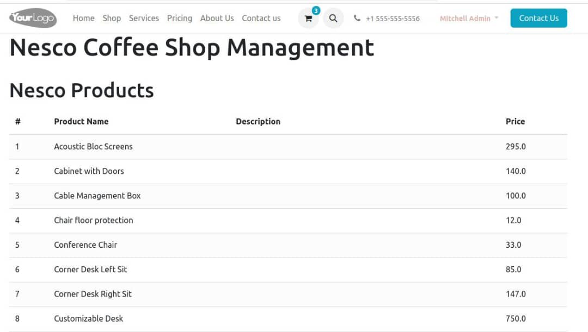

NESCO Coffee Shop :

A comprehensive management system for a coffee shop using Odoo, focusing on
three main modules: Website, Sales, and Inventory.
The coffee shop aims to provide a seamless online experience for customers to
browse the menu, place orders(create new), update and searh for specific product.
An integrated system to enhance both customer engagement and operational efficiency.
**Key Features:**
* 1. **Website Module:**
- ** A User-Friendly Website:** a visually appealing website for Nesco coffee that
showcases the menu, coffee blends, and special offers and coffee bags for sales.
- **Online Ordering System:** Allows customers to place orders directly
from the website. Include options for pickup.
2. **Sales Module:**
- **Point of Sale (POS) Integration:** Set up a POS system for in-store transactions, ensuring a
seamless checkout experience.
- **Sales Reports:** Generate sales reports to analyze daily and monthly performance.
3. **Inventory Module:**
- **Product Management:** Manage coffee products, including descriptions, pricing, and stock levels.
- **Stock Monitoring:** Implement automatic stock level monitoring to alert when items are low,
ensuring that popular blends are always available.

Current Technical Challenge :

I suppose if we face credentials problem on the exsisting payment mentod or ex we want to add
a new provider which does not provided by odoo also the loading traffic may increase which can affect on system.
Solution : 
- I'm testing avialbe provider some are work well also we can add extranal provider by using 
odoo JSON/RPC Api or extranl API such as REST API.
- I can Implement or configure odoo with Nginx.Whcih could work as reverse proxy,caching,load balancing.

Installation :

1- Install Odoo 17 on your server following the [official documentation](https://www.odoo.com/documentation/17.0/administration/on_premise.html)
 
2- Clone this repository:git clone https://github.com/huzaifa250/NESCO.git 

3- Add the nesco  module to your Odoo 17 addons path

4- Update the Odoo module list and install the nesco module

For detailed installation instructions, please refer to the [documentation](https://www.odoo.com/documentation/17.0/).

## Contributing :

I welcome contributions to Nesco! Whether it's improving documentation, adding new features, or reporting bugs, your help is appreciated. Please see my [contributing guidelines](link-to-contributing) for more information.

## Connect With me

- [Huzaifa Elnaeem](https://www.linkedin.com/in/huzaifa-elnaeem-415042a6/)

## License

This project is licensed under the MIT License - see the [LICENSE](link-to-license) file for details.
